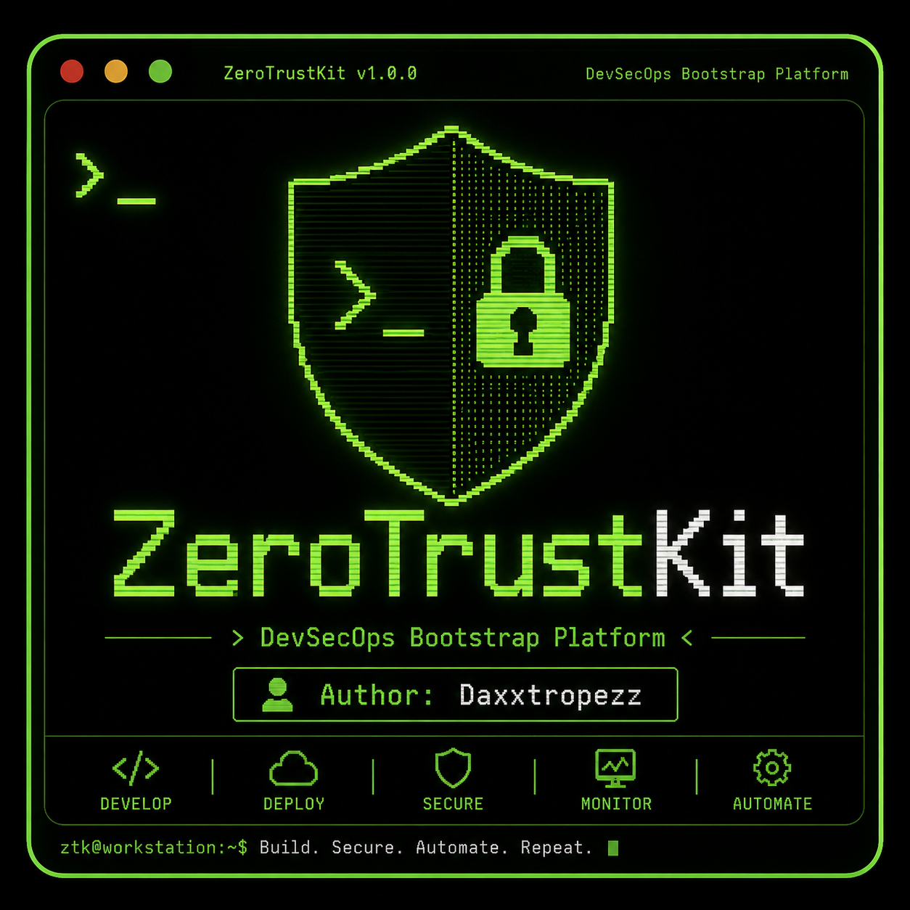
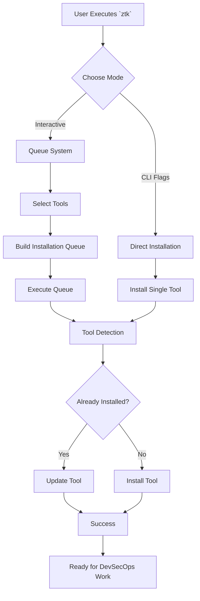

# ZeroTrustKit (ZTK)

<p align="center">
  
</p>

<h3 align="center">
DevSecOps Bootstrap Platform for Ubuntu
</h3>

<p align="center">
One command. Complete DevSecOps workstation.
</p>

<p align="center">
  
  
  
  
</p>

---

## Overview

ZeroTrustKit (ZTK) is a DevSecOps bootstrap platform designed to quickly prepare Ubuntu systems for modern cloud, infrastructure, security, and automation workflows.

The project provides an interactive terminal interface that allows engineers to install and update commonly used DevOps, DevSecOps, Cloud, Kubernetes, and Security tools from a single location.

## Architecture



## Features

### Interactive Installation Queue

* Select multiple tools
* Queue-based execution
* Installation status detection
* Update existing installations
* Colorized terminal interface
* Fast setup experience

### Included Tools

| Category               | Tools                                 |
| ---------------------- | ------------------------------------- |
| Infrastructure as Code | Terraform                             |
| Cloud                  | AWS CLI, Google Cloud SDK             |
| Containers             | Docker, Docker Compose, Lazydocker    |
| Kubernetes             | kubectl, Helm, Minikube               |
| Security               | Snyk, Trivy                           |
| Automation             | Ansible                               |
| Networking             | Nmap                                  |
| Development            | Git, Python                           |
| Utilities              | curl, wget, jq, tmux, zsh, htop, tree |

---

# Installation

## Option 1: Launchpad PPA (Recommended)

Add the official repository:

```bash
sudo add-apt-repository ppa:daxxtropezz/ztk
sudo apt update
sudo apt install ztk
```

Supported Ubuntu Releases:

| Ubuntu Release | Codename |
| -------------- | -------- |
| 24.04          | noble    |
| 22.04          | jammy    |
| 25.10          | resolute |

---

## Option 2: Manual APT Repository

Add the repository manually.

Replace `YOUR_UBUNTU_VERSION_HERE` with:

* noble
* jammy
* resolute

```bash
deb https://ppa.launchpadcontent.net/daxxtropezz/ztk/ubuntu YOUR_UBUNTU_VERSION_HERE main
deb-src https://ppa.launchpadcontent.net/daxxtropezz/ztk/ubuntu YOUR_UBUNTU_VERSION_HERE main
```

Import repository key and update:

```bash
sudo apt update
```

Install:

```bash
sudo apt install ztk
```

---

## Option 3: Clone Repository

Clone the project directly:

```bash
git clone https://github.com/daxxtropezz/ZeroTrustKit.git
```

Navigate to the project:

```bash
cd ZeroTrustKit
```

Make the script executable:

```bash
chmod +x ztk
```

Run:

```bash
./ztk
```

---

# Usage

## Interactive Mode

Launch:

```bash
ztk
```

Select tools:

```text
[1-16] Select/Deselect Tool
[0] Execute Queue
[C] Clear Queue
[R] Refresh
[Q] Quit
```

---

## Install Individual Tool

Example:

```bash
ztk --install terraform
```

Install Docker:

```bash
ztk --install docker
```

Install Trivy:

```bash
ztk --install trivy
```

---

## List Available Tools

```bash
ztk --list
```

---

## Check Installation Status

```bash
ztk --status
```

---

## Help

```bash
ztk --help
```

---

# Supported Tools

| Tool             | Purpose                      |
| ---------------- | ---------------------------- |
| Git              | Version Control              |
| Terraform        | Infrastructure as Code       |
| AWS CLI          | AWS Management               |
| Docker           | Containers                   |
| Docker Compose   | Multi-container Applications |
| Lazydocker       | Docker TUI                   |
| Ansible          | Automation                   |
| Snyk             | Security Scanning            |
| Trivy            | Vulnerability Scanning       |
| Google Cloud SDK | GCP Management               |
| kubectl          | Kubernetes                   |
| Helm             | Kubernetes Package Manager   |
| Minikube         | Local Kubernetes             |
| Nmap             | Network Discovery            |
| Python           | Development Environment      |

---

# Screenshots

```text
Insert terminal screenshots here
```

---

# Roadmap

Future planned additions:

* Azure CLI (Not available in resolute yet)
<!-- * OpenTofu
* Podman
* Falco
* kube-bench
* kube-hunter
* Checkov
* Terrascan
* OWASP ZAP
* Burp Suite Community
* Semgrep
* GitHub CLI
* GitLab CLI
* ArgoCD CLI
* FluxCD
* Vault CLI
* Tailscale -->

---

# Contributing

Contributions are welcome.

1. Fork the repository
2. Create a feature branch
3. Commit your changes
4. Push your branch
5. Open a Pull Request

---

# Security

If you discover a security issue, please open a private security report through GitHub Security Advisories.

---

# Author

Daxxtropezz

---

# License

This project is licensed under the [MIT LICENSE](LICENSE).
