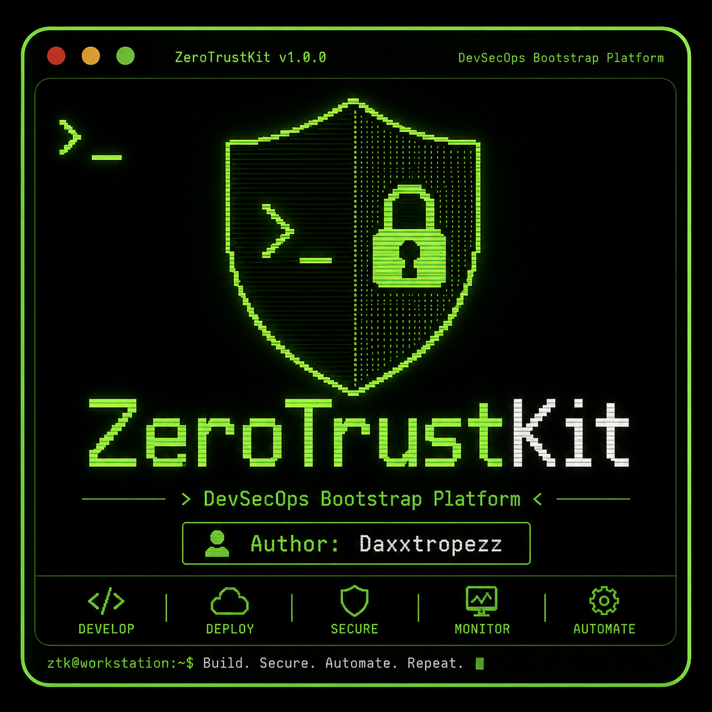
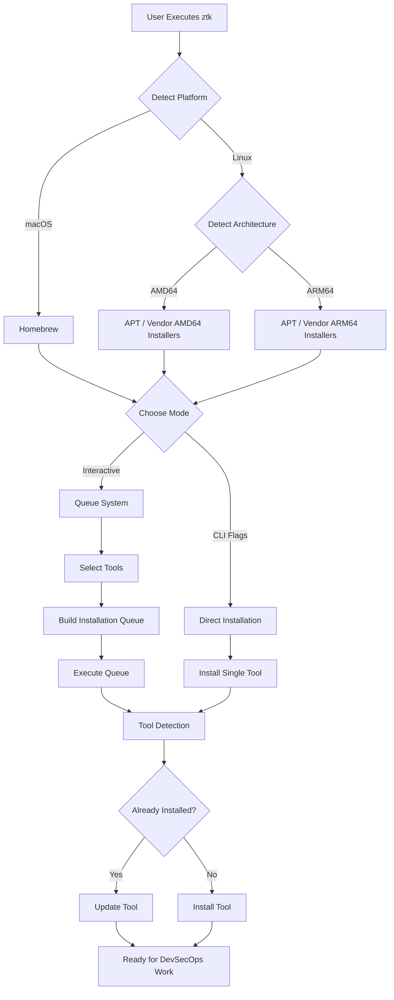
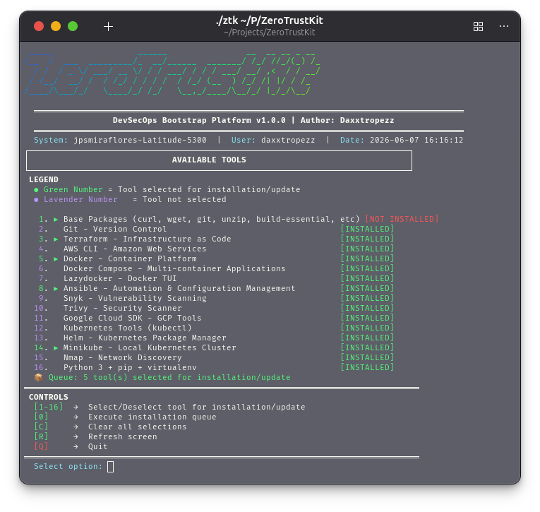
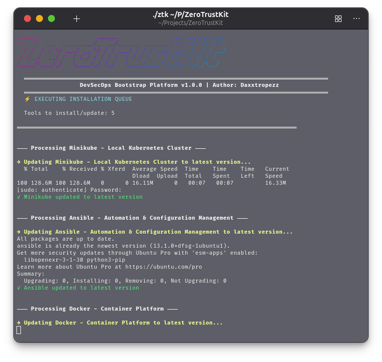

# ZeroTrustKit (ZTK)

<p align="center">
  
</p>

<h3 align="center">
DevSecOps Bootstrap Platform for Ubuntu and macOS
</h3>

<p align="center">
One command. Complete DevSecOps workstation.
</p>

<p align="center">
  
  
  
  
  
  
</p>

---

## Overview

ZeroTrustKit (ZTK) is a cross-platform DevSecOps bootstrap platform for quickly preparing Ubuntu and macOS workstations for modern cloud, infrastructure, security, container, Kubernetes, and automation workflows.

ZTK provides an interactive terminal interface that lets engineers install or update commonly used DevOps and DevSecOps tools from one place. It automatically detects the operating system and architecture, then selects the appropriate installation backend:

- **Ubuntu/Linux:** APT and vendor-provided Linux installers
- **macOS:** Homebrew
- **Linux architectures:** AMD64/x86_64 and ARM64/aarch64
- **macOS architectures:** Intel and Apple Silicon

> **macOS note:** Homebrew is the supported installation path for ZTK on macOS. ZTK uses Bash features newer than the Bash version bundled with macOS, so the Homebrew formula declares a compatible Bash dependency.

## Architecture


```mermaid
graph TD
    A[User Executes ztk] --> B{Detect Platform}
    B -->|Linux| C{Detect Architecture}
    B -->|macOS| D[Homebrew]

    C -->|AMD64| E[APT / Vendor AMD64 Installers]
    C -->|ARM64| F[APT / Vendor ARM64 Installers]

    D --> G{Choose Mode}
    E --> G
    F --> G

    G -->|Interactive| H[Queue System]
    G -->|CLI Flags| I[Direct Installation]

    H --> J[Select Tools]
    J --> K[Build Installation Queue]
    K --> L[Execute Queue]

    I --> M[Install Single Tool]

    L --> N[Tool Detection]
    M --> N

    N --> O{Already Installed?}
    O -->|Yes| P[Update Tool]
    O -->|No| Q[Install Tool]

    P --> R[Ready for DevSecOps Work]
    Q --> R
```

## Features

### Interactive Installation Queue

- Select multiple tools before execution
- Queue-based installation and updates
- Detect existing installations
- Update supported tools to newer versions
- Platform-aware APT/Homebrew backend
- AMD64 and ARM64 Linux architecture detection
- Colorized terminal interface
- Direct single-tool installation through CLI flags

### Included Tools

| Category | Tools |
| --- | --- |
| Infrastructure as Code | Terraform |
| Cloud | AWS CLI, Google Cloud CLI, Azure CLI |
| Containers | Docker, Docker Compose, Lazydocker |
| Kubernetes | kubectl, Helm, Minikube |
| Security | Snyk, Trivy |
| Automation | Ansible |
| Networking | Nmap |
| Development | Git, Python |
| Utilities | curl, wget, jq, tmux, zsh, htop, tree |

---

# Installation

## macOS — Homebrew (Recommended)

Install ZeroTrustKit directly from the official tap:

```bash
brew install Daxxtropezz/tap/ztk
```

Homebrew can install a fully qualified formula directly from a tap, so manually tapping the repository first is optional.

Then launch ZTK:

```bash
ztk
```

Alternatively, add the tap first:

```bash
brew tap Daxxtropezz/tap
brew install Daxxtropezz/tap/ztk
```

### macOS Requirements

- Homebrew
- Intel or Apple Silicon Mac

The Homebrew formula installs a compatible Bash version required by ZTK.

> Docker installation on macOS uses Docker Desktop through Homebrew Cask.

---

## Ubuntu — Launchpad PPA (Recommended)

Add the official PPA and install ZTK:

```bash
sudo add-apt-repository ppa:daxxtropezz/ztk
sudo apt update
sudo apt install ztk
```

### Supported Ubuntu Releases

| Ubuntu Release | Codename |
| --- | --- |
| 24.04 | noble |
| 22.04 | jammy |
| 25.10 | resolute |

### Supported Linux Architectures

ZTK v1.2.2 detects the host architecture and maps architecture-specific third-party downloads accordingly:

| Architecture | Common Names | ZTK Support |
| --- | --- | :---: |
| AMD64 | `x86_64`, `amd64` | ✓ |
| ARM64 | `arm64`, `aarch64` | ✓ |

Architecture-aware installation is used for tools such as AWS CLI, kubectl, Minikube, Snyk, and Lazydocker where the upstream project provides architecture-specific artifacts.

> Individual third-party tools are still subject to the architectures and Linux distributions supported by their upstream vendors.

### Azure CLI on Ubuntu

Azure CLI is available as the `azure_cli` ZTK tool.

```bash
ztk --install azure_cli
```

ZTK uses Microsoft's Debian/Ubuntu installer when Azure CLI is not already installed and APT for subsequent upgrades.

> Microsoft currently documents Ubuntu 22.04 (`jammy`) and Ubuntu 24.04 (`noble`) as tested Ubuntu releases for Azure CLI packages. On another Ubuntu codename, ZTK displays a warning and attempts the official Microsoft installer, but successful installation is not guaranteed.

---

## Ubuntu — Manual APT Repository

Add the repository manually if you do not want to use `add-apt-repository`.

Replace `YOUR_UBUNTU_VERSION_HERE` with a supported PPA codename such as `noble`, `jammy`, or `resolute`:

```text
deb https://ppa.launchpadcontent.net/daxxtropezz/ztk/ubuntu YOUR_UBUNTU_VERSION_HERE main
deb-src https://ppa.launchpadcontent.net/daxxtropezz/ztk/ubuntu YOUR_UBUNTU_VERSION_HERE main
```

Update package metadata and install:

```bash
sudo apt update
sudo apt install ztk
```

---

## Clone Repository

### Ubuntu/Linux

Clone the project directly:

```bash
git clone https://github.com/Daxxtropezz/ZeroTrustKit.git
cd ZeroTrustKit
chmod +x ztk
./ztk
```

### macOS

For macOS, the recommended and supported installation method is Homebrew:

```bash
brew install Daxxtropezz/tap/ztk
```

A stock macOS installation includes an older system Bash that does not support all Bash features used by ZTK. Avoid running the repository script directly with `/bin/bash` unless you have already installed and selected a modern Bash version.

---

# Usage

## Interactive Mode

Launch ZTK:

```bash
ztk
```

Controls:

```text
[1-17]  Select/Deselect Tool
[0]     Execute Queue
[C]     Clear Queue
[R]     Refresh
[Q]     Quit
```

---

## Install an Individual Tool

Install Terraform:

```bash
ztk --install terraform
```

Install Docker:

```bash
ztk --install docker
```

Install Trivy:

```bash
ztk --install trivy
```

Install Azure CLI:

```bash
ztk --install azure_cli
```

---

## List Available Tools

```bash
ztk --list
```

---

## Check Installation Status

```bash
ztk --status
```

---

## Help

```bash
ztk --help
```

---

# Supported Tools

| Tool | Purpose | Ubuntu AMD64 | Ubuntu ARM64 | macOS |
| --- | --- | :---: | :---: | :---: |
| Git | Version Control | ✓ | ✓ | ✓ |
| Terraform | Infrastructure as Code | ✓ | ✓ | ✓ |
| AWS CLI | AWS Management | ✓ | ✓ | ✓ |
| Docker | Container Platform | ✓ | ✓ | ✓ |
| Docker Compose | Multi-container Applications | ✓ | ✓ | ✓ |
| Lazydocker | Docker TUI | ✓ | ✓ | ✓ |
| Ansible | Automation | ✓ | ✓ | ✓ |
| Snyk | Security Scanning | ✓ | ✓ | ✓ |
| Trivy | Vulnerability Scanning | ✓ | ✓ | ✓ |
| Google Cloud CLI | GCP Management | ✓ | ✓ | ✓ |
| Azure CLI | Microsoft Azure Management | ✓* | ✓* | ✓ |
| kubectl | Kubernetes CLI | ✓ | ✓ | ✓ |
| Helm | Kubernetes Package Manager | ✓ | ✓ | ✓ |
| Minikube | Local Kubernetes Cluster | ✓ | ✓ | ✓ |
| Nmap | Network Discovery | ✓ | ✓ | ✓ |
| Python | Development Environment | ✓ | ✓ | ✓ |

\* Azure CLI installation on Ubuntu depends on Microsoft's package support for the detected Ubuntu release. ZTK warns when the detected Ubuntu codename is outside the releases currently documented as tested by Microsoft.

---

# Platform and Architecture Behavior

ZTK automatically detects the host operating system using `uname -s` and the architecture using `uname -m`.

```text
Linux / x86_64  -> APT + AMD64 vendor installers
Linux / aarch64 -> APT + ARM64 vendor installers
macOS / Intel   -> Homebrew
macOS / ARM64   -> Homebrew
```

On macOS, ZTK uses Homebrew formulae and casks where appropriate. On Ubuntu, it uses APT, PPAs, and vendor-provided installers.

For architecture-specific Linux downloads, ZTK translates the host architecture into the naming expected by the upstream project. For example, an `aarch64` Linux host is mapped to ARM64-compatible artifacts.

---

# Preview




---

# Roadmap

Future planned improvements include:

- More DevSecOps and cloud-native tooling
- Improved installation result and error reporting
- Platform-specific health checks
- Expanded Linux distribution support
- Automated release and package validation

<!--
Potential tools:
- OpenTofu
- Podman
- Falco
- kube-bench
- kube-hunter
- Checkov
- Terrascan
- OWASP ZAP
- Burp Suite Community
- Semgrep
- GitHub CLI
- GitLab CLI
- ArgoCD CLI
- FluxCD
- Vault CLI
- Tailscale
-->

---

# Contributing

Contributions are welcome.

1. Fork the repository.
2. Create a feature branch.
3. Commit your changes.
4. Push the branch.
5. Open a Pull Request.

---

# Security

If you discover a security issue, please open a private security report through GitHub Security Advisories rather than a public issue.

---

# Author

Daxxtropezz

---

# License

This project is licensed under the [MIT License](LICENSE).
